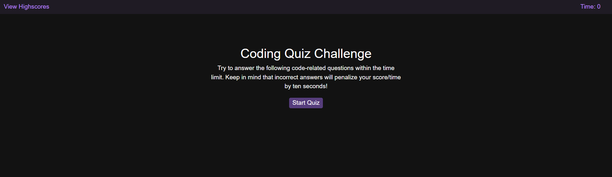
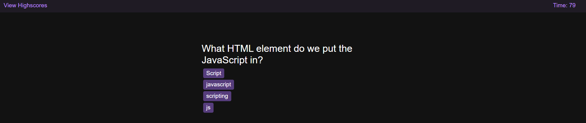
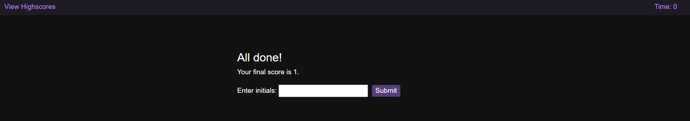

# multiple-choice-quiz
a multiple choice quiz using APIs. 
Link to Webpage: https://josh484.github.io/multiple-choice-quiz/
## Description 
This project highlights my knowledge in traversing through the DOM, javascript events and client side storage.
Although still shaky I think my understanding of APIs has increased.
At the end of this project I am more confident in my use of javaScript. 
## Installation
In order to install the project simply click the green code button and download the file as a zip. 
Once downloaded simply right click on the file and unzip the folder.
## Usage 
Once the file is downloaded you can open the index.html on your web browser you will be met with this page:
.
The button on the middle will start the game whilst the view highscores will take you onto the Highscores page. 
Pressing the middle button looks like this: 
.
after finishing the quiz you will be met with the score page and you will get a score based on how well you did. 
Putting your initials in will save your score and name and take you to the highscore page.

The highscore page looks like this:

## Features
In this section I will go over the javascript features of the page.
- At the beginning of the page there is a function that takes the scores saved from local storage using JSON.parse and puts that into an array of highscores provided that there is something in the local storage otherwise pass an empty array.
- In the landing page, The button kicks off everything as an event listener onclick it starts the timer function which countsdown from 30. It hides the start screen div and unhides the quiz div. 
1. The function quizzes activates which takes the first quiz array and appends them as h2 for question text and buttons for answers and gives buttons a data attribute of true or false.
- The buttons also have a listener on click. If the user presses a button with a true attribute they gain a point and if false then they get a fail counter they cannot see which is saved onto local storage the 3 functions are activated:
1. remove function which will remove the current question and answers
2. move array which starts from the 2nd question onward and puts it into the quizzes function to create the next batch of arrays. A counter goes up so that when the user clicks an answer it will lead to the next quiz.
3. answerTimer function, counts down from 2 seconds and briefly shows if the user gets the answer correct or incorrect. 
4. If incorrect the total timer also goes down.
- If the user gets a total of 4 from fail counters and point counters the quiz will end showing the end screen. 
- The end screen outputs their correct answers points. There is a textbox where the user must put in their name or initials and on the button a listener function that takes their input and score pushes that into the highscore array which contains all the other highscores and saves the array to local storage by using JSON and using stringify to pass the array as a string. The user will also be taken to the highscore page.
- If the timer reaches 0 before the user can complete the quiz then the user will be taken to the end screen.
- In highscores.html the first function is the same as the first function of the previous page.
- the render function takes the data saved onto local storage and loops through each to create a list and append that onto its parent ordered list.
- The final function is the clear button listener that when on click makes the highscores array empty and saves that empty array to local storage and reloads the page which will show an empty highscore as the data saved is now empty.

